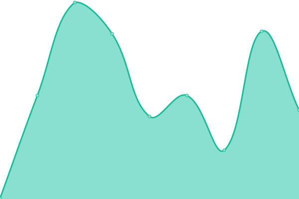
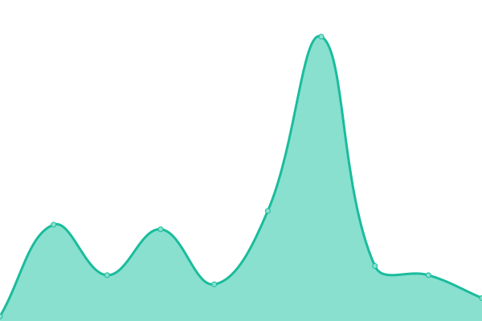

# [📈 Live Status](https://demo.upptime.js.org): <!--live status--> **🟩 All systems operational**

This repository contains the open-source uptime monitor and status page for [Upptime](https://upptime.js.org), powered by [Upptime](https://github.com/upptime/upptime).

With [Upptime](https://upptime.js.org), you can get your own unlimited and free uptime monitor and status page, powered entirely by a GitHub repository. We use [Issues](https://github.com/upptime/arara-status-page/issues) as incident reports, [Actions](https://github.com/upptime/arara-status-page/actions) as uptime monitors, and [Pages](https://demo.upptime.js.org) for the status page.

<!--start: status pages-->
<!-- This summary is generated by Upptime (https://github.com/upptime/upptime) -->
<!-- Do not edit this manually, your changes will be overwritten -->
<!-- prettier-ignore -->
| URL | Status | History | Response Time | Uptime |
| --- | ------ | ------- | ------------- | ------ |
|  [Communications dev](https://api-dev.araraholding.com/api/comms/health) | 🟩 Up | [communications-dev.yml](https://github.com/GoGipsy/arara-status-page/commits/HEAD/history/communications-dev.yml) | 

 270ms
     
 | 

<a href="https://GoGipsy.github.io/arara-status-page/history/communications-dev">100.00%</a>
    

|  [Payments Dev](https://api-dev.araraholding.com/payments/v1/internal/healthcheck) | 🟩 Up | [payments-dev.yml](https://github.com/GoGipsy/arara-status-page/commits/HEAD/history/payments-dev.yml) | 

 49ms
     
 | 

<a href="https://GoGipsy.github.io/arara-status-page/history/payments-dev">100.00%</a>
    

|  [Payments Prod](https://api.araraholding.com/payments/v1/internal/healthcheck) | 🟩 Up | [payments-prod.yml](https://github.com/GoGipsy/arara-status-page/commits/HEAD/history/payments-prod.yml) | 

 279ms
     
 | 

<a href="https://GoGipsy.github.io/arara-status-page/history/payments-prod">100.00%</a>
    

<!--end: status pages-->

[**Visit our status website →**](https://demo.upptime.js.org)

## 📄 License

- Powered by: [Upptime](https://github.com/upptime/upptime)
- Code: [MIT](./LICENSE) © [Anand Chowdhary](https://anandchowdhary.com), supported by [Pabio](https://pabio.com)
- Data in the `./history` directory: [Open Database License](https://opendatacommons.org/licenses/odbl/1-0/)
